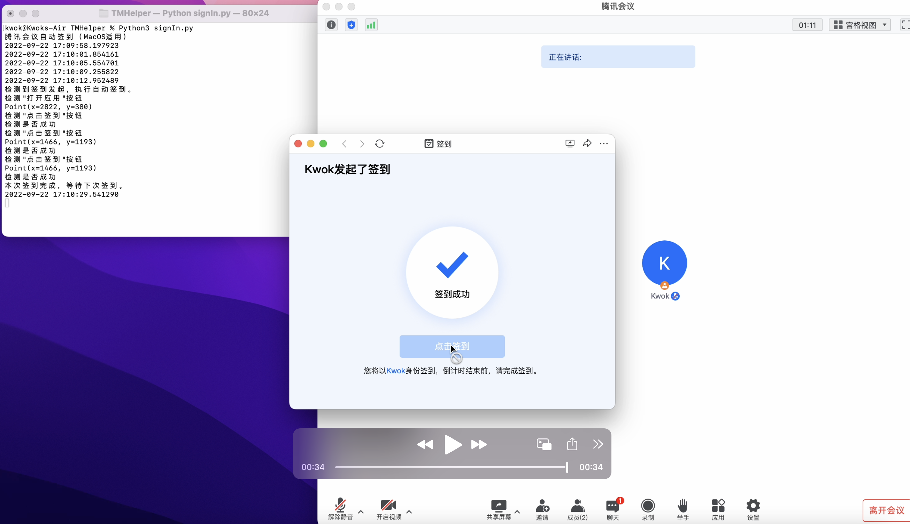

# TMHelper
腾讯会议自动签到，Tencent Meeting

适用于MacOS （不知道Windows的腾讯会议签到操作是否和MacOS一样）

仅在MacBookAir M2上进行过测试，其他机型可能需要修改鼠标移动时的代码。

```python
pyautogui.moveTo(x*0.5,y*0.5)  # 鼠标移动  *0.5是为了hidpi引起的显示大小与渲染大小不同导致的实际坐标问题。 
#其他机型可能不需要*0.5 这个请问题自行测试并修改
```

需要安装的依赖

opencv-python  

 Pillow

PyAutoGUI 


